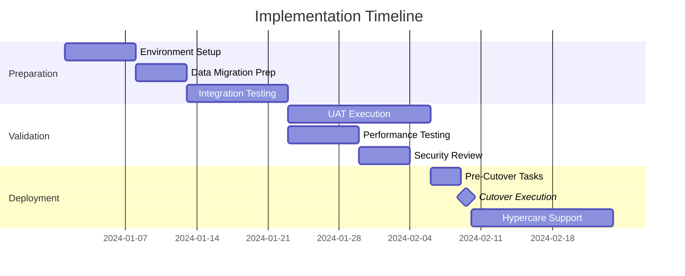

# Implementation Planning

## Overview

Implementation planning is the structured process of translating project requirements and technical designs into actionable deployment strategies. It bridges the gap between development completion and successful production deployment, ensuring all stakeholders understand their roles, dependencies are mapped, and risks are mitigated before go-live.

Effective implementation planning encompasses resource allocation, timeline management, dependency coordination, rollback procedures, and stakeholder communication. It requires balancing technical constraints with business requirements while maintaining flexibility for unexpected challenges during deployment.

The discipline extends beyond simple checklists to include capacity planning, environment preparation, data migration strategies, integration testing coordination, and post-implementation support structures. A well-executed implementation plan reduces deployment risk, minimizes downtime, and accelerates time-to-value for new systems.

### Why This Matters

- **Risk Reduction**: Structured planning identifies potential failure points before they impact production
- **Stakeholder Alignment**: Clear timelines and responsibilities prevent confusion during critical deployment windows
- **Cost Control**: Proper resource planning prevents expensive emergency interventions
- **Business Continuity**: Well-planned cutovers minimize disruption to ongoing operations
- **Compliance Assurance**: Documented processes support audit requirements and regulatory compliance
- **Team Confidence**: Clear procedures reduce stress and improve execution quality

## When to Use

### Primary Triggers

- New system deployment to production environment
- Major version upgrades requiring coordinated changes
- Data center migrations or cloud transitions
- Multi-system integration rollouts
- Business-critical feature releases
- Merger/acquisition system consolidations

### Specific Use Cases

1. **Greenfield Deployments**: New applications with no existing user base
2. **Brownfield Migrations**: Replacing legacy systems with active users
3. **Phased Rollouts**: Geographic or functional staged deployments
4. **Big Bang Cutovers**: Single-event full system transitions
5. **Parallel Running**: Operating old and new systems simultaneously
6. **Canary Releases**: Gradual traffic shifting to new versions

## Core Processes

### Process 1: Implementation Readiness Assessment

Evaluate organizational and technical readiness before committing to deployment timelines.

```yaml
# implementation-readiness-checklist.yaml
readiness_assessment:
  technical_criteria:
    code_complete:
      status: pending
      owner: development_lead
      evidence: "All features merged to release branch"

    testing_complete:
      status: pending
      owner: qa_lead
      evidence: "Test execution report with >95% pass rate"

    performance_validated:
      status: pending
      owner: performance_engineer
      evidence: "Load test results meeting SLA targets"

    security_cleared:
      status: pending
      owner: security_team
      evidence: "Security scan report with no critical findings"

    infrastructure_ready:
      status: pending
      owner: platform_team
      evidence: "Environment provisioning complete"

  operational_criteria:
    runbooks_documented:
      status: pending
      owner: operations_team
      evidence: "Runbook review completed"

    monitoring_configured:
      status: pending
      owner: sre_team
      evidence: "Dashboards and alerts active in staging"

    support_trained:
      status: pending
      owner: support_manager
      evidence: "Training completion certificates"

    rollback_tested:
      status: pending
      owner: release_manager
      evidence: "Rollback drill execution log"

  business_criteria:
    stakeholder_signoff:
      status: pending
      owner: project_sponsor
      evidence: "Signed approval document"

    communication_plan:
      status: pending
      owner: communications_team
      evidence: "Notification schedule approved"

    change_approved:
      status: pending
      owner: change_manager
      evidence: "CAB approval ticket"
```

### Process 2: Cutover Planning

Define the precise sequence of activities for production transition.

```markdown
# Cutover Plan Template

## Pre-Cutover (T-24 hours)
| Time | Activity | Owner | Duration | Checkpoint |
|------|----------|-------|----------|------------|
| T-24h | Final code freeze | Dev Lead | - | Branch locked |
| T-20h | Production backup | DBA | 2h | Backup verified |
| T-18h | Staging validation | QA Lead | 4h | Sign-off received |
| T-12h | War room setup | Release Mgr | 1h | Comms tested |
| T-8h | Team standby confirmed | All Leads | - | Roster confirmed |

## Cutover Execution (T-0)
| Step | Activity | Owner | Est. Time | Rollback Point |
|------|----------|-------|-----------|----------------|
| 1 | Enable maintenance mode | Ops | 5 min | RP-1 |
| 2 | Stop application services | Ops | 10 min | RP-1 |
| 3 | Execute database migration | DBA | 30 min | RP-2 |
| 4 | Deploy application artifacts | DevOps | 20 min | RP-3 |
| 5 | Update configuration | DevOps | 10 min | RP-3 |
| 6 | Start application services | Ops | 10 min | RP-4 |
| 7 | Execute smoke tests | QA | 15 min | RP-4 |
| 8 | Disable maintenance mode | Ops | 5 min | RP-5 |
| 9 | Monitor metrics | SRE | 60 min | - |

## Post-Cutover Validation
- [ ] All health checks passing
- [ ] Error rates within threshold (<0.1%)
- [ ] Response times within SLA
- [ ] Business transactions completing
- [ ] Integration endpoints responding
```

### Process 3: Risk Management Matrix

```yaml
# implementation-risks.yaml
risks:
  - id: RISK-001
    category: technical
    description: "Database migration exceeds maintenance window"
    probability: medium
    impact: high
    mitigation:
      - "Pre-migrate static data during business hours"
      - "Parallelize migration scripts where possible"
      - "Have extended window approval pre-secured"
    contingency: "Invoke rollback procedure RP-2"
    owner: dba_lead

  - id: RISK-002
    category: integration
    description: "Third-party API incompatibility discovered"
    probability: low
    impact: critical
    mitigation:
      - "Complete integration testing 2 weeks prior"
      - "Maintain API version compatibility layer"
      - "Document vendor escalation contacts"
    contingency: "Enable API gateway fallback routing"
    owner: integration_architect

  - id: RISK-003
    category: operational
    description: "Key personnel unavailable during cutover"
    probability: medium
    impact: medium
    mitigation:
      - "Cross-train backup resources"
      - "Document all procedures in runbooks"
      - "Confirm availability 48 hours prior"
    contingency: "Reschedule to next available window"
    owner: release_manager

  - id: RISK-004
    category: business
    description: "User adoption issues post-deployment"
    probability: medium
    impact: medium
    mitigation:
      - "Conduct user acceptance testing"
      - "Provide training materials in advance"
      - "Schedule hypercare support period"
    contingency: "Extend parallel running period"
    owner: change_manager
```

### Process 4: Communication Plan

```yaml
# implementation-communications.yaml
communication_plan:
  pre_implementation:
    - audience: all_users
      timing: T-14 days
      channel: email
      message_type: announcement
      content: "System upgrade scheduled - overview and impact"
      owner: communications_team

    - audience: power_users
      timing: T-7 days
      channel: training_session
      message_type: preparation
      content: "New features walkthrough and Q&A"
      owner: training_team

    - audience: it_support
      timing: T-3 days
      channel: teams_meeting
      message_type: briefing
      content: "Support procedures and escalation paths"
      owner: support_manager

  during_implementation:
    - audience: stakeholders
      timing: each_milestone
      channel: status_dashboard
      message_type: progress_update
      content: "Real-time cutover status"
      owner: release_manager

    - audience: all_users
      timing: maintenance_start
      channel: system_banner
      message_type: notification
      content: "System maintenance in progress"
      owner: operations_team

  post_implementation:
    - audience: all_users
      timing: T+0 hours
      channel: email
      message_type: completion
      content: "System upgrade complete - what's new"
      owner: communications_team

    - audience: stakeholders
      timing: T+24 hours
      channel: report
      message_type: summary
      content: "Implementation summary and metrics"
      owner: project_manager
```

## Tools & Templates

### Implementation Timeline Template



### Go/No-Go Decision Framework

```yaml
go_nogo_criteria:
  mandatory_gates:
    - name: "All P1 defects resolved"
      threshold: 100%
      actual: null
      status: pending

    - name: "Performance SLAs met"
      threshold: 100%
      actual: null
      status: pending

    - name: "Security clearance obtained"
      threshold: required
      actual: null
      status: pending

    - name: "Business stakeholder approval"
      threshold: required
      actual: null
      status: pending

  advisory_gates:
    - name: "P2 defects resolved"
      threshold: 90%
      actual: null
      status: pending

    - name: "Documentation complete"
      threshold: 95%
      actual: null
      status: pending

    - name: "Training completion rate"
      threshold: 80%
      actual: null
      status: pending

  decision_matrix:
    all_mandatory_pass:
      all_advisory_pass: "GO"
      advisory_gaps: "GO with conditions"
    mandatory_gaps:
      any_status: "NO-GO"
```

## Metrics & KPIs

| Metric | Target | Measurement Method |
|--------|--------|-------------------|
| Cutover Success Rate | >95% | Implementations without rollback |
| Schedule Variance | <10% | Actual vs planned duration |
| Defect Escape Rate | <5% | Post-deploy defects vs total |
| Rollback Frequency | <5% | Rollbacks per deployment |
| User Impact Duration | <4 hours | Planned downtime adherence |
| Stakeholder Satisfaction | >4.0/5.0 | Post-implementation survey |
| First-Call Resolution | >80% | Support tickets resolved immediately |

## Common Pitfalls

1. **Insufficient Testing Time**: Compressing UAT to meet arbitrary deadlines
   - *Solution*: Build buffer time and define minimum testing thresholds

2. **Incomplete Rollback Planning**: Assuming forward-only deployment
   - *Solution*: Test rollback procedures with same rigor as deployment

3. **Communication Gaps**: Surprising users with changes
   - *Solution*: Multi-channel, multi-timing communication strategy

4. **Single Points of Failure**: Critical knowledge held by one person
   - *Solution*: Cross-training and comprehensive documentation

5. **Scope Creep**: Adding features during implementation phase
   - *Solution*: Strict change freeze with documented exception process

6. **Optimistic Scheduling**: Underestimating task complexity
   - *Solution*: Use historical data and add contingency buffers

## Integration Points

- **Project Management**: Timeline synchronization, resource allocation
- **Change Management**: CAB approvals, change records
- **Service Desk**: Incident routing, user support
- **Monitoring Systems**: Alert configuration, dashboard setup
- **Configuration Management**: Environment specifications, versioning
- **Documentation Systems**: Runbooks, user guides, training materials
- **Communication Platforms**: Stakeholder notifications, status updates
