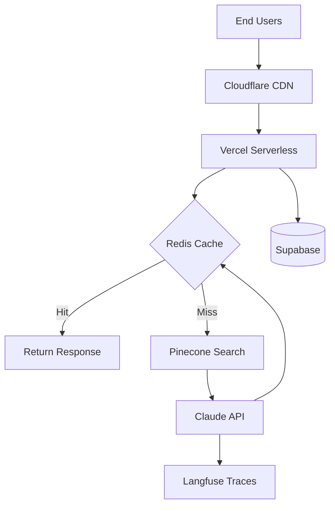

# AI Solution Architecture

## Purpose

Design production-grade AI/ML solution architectures for enterprise B2B clients during pre-sales cycles. Creates reference architectures, integration maps, infrastructure estimates, and technical proposals that de-risk implementation and accelerate sales cycles.

## When to Use

- Customer asks: "How would this AI solution integrate with our existing systems?"
- Sales team needs: Technical architecture for enterprise RFP response
- Pre-sales scenario: Scoping AI implementation for Fortune 500 client
- Discovery call requires: Infrastructure sizing for 100K+ users with AI features
- Proposal stage: Reference architecture for multi-tenant AIaaS platform

## Trigger Patterns

**Keywords:** solution design, AI architecture, technical scoping, integration mapping, infrastructure sizing, pre-sales, RFP response, reference architecture, technical proposal

**Phrases:**
- "Design an AI solution for..."
- "What architecture do we need for..."
- "How would this integrate with..."
- "Size the infrastructure for..."
- "Create technical proposal for..."

## Core Workflow

### 1. Discovery & Requirements Gathering

**Inputs Required:**
```yaml
business_context:
  - use_case: "Customer support automation"
  - user_scale: "50K active users, 500K requests/month"
  - performance_sla: "p95 < 2s response time"
  - availability_target: "99.9% uptime"
  - budget_range: "$50K-$100K/year infrastructure"
  
existing_systems:
  - crm: "Salesforce"
  - helpdesk: "Zendesk"
  - data_warehouse: "Snowflake"
  - auth: "Okta SSO"
  
constraints:
  - compliance: ["SOC 2", "GDPR"]
  - deployment: "US-only, no data residency in EU"
  - latency: "Sub-2-second p95"
  - data_retention: "7 years for audit"
```

**Clarifying Questions:**
1. What AI capabilities are required? (Classification, generation, RAG, agents)
2. What existing data sources will AI consume? (APIs, databases, documents)
3. What are the failure modes and fallback requirements?
4. Is real-time required, or can processing be async?
5. What is the expected request volume (requests/sec at peak)?

### 2. Architecture Design

**See:** `references/architecture-patterns.md` for full pattern library

**Component Selection:**

```yaml
# Model Layer
model_provider:
  primary: "Anthropic Claude Sonnet"
  fallback: "OpenAI GPT-4"
  rationale: "Claude for quality, GPT-4 for availability"
  
# Embedding Layer (if RAG required)
embedding_provider:
  choice: "OpenAI text-embedding-3-small"
  rationale: "Cost-effective, 1536 dims, batch processing"

# Vector Database (if RAG required)
vector_db:
  choice: "Pinecone Serverless"
  rationale: "Auto-scaling, <100ms p99, managed service"
  
# Caching Strategy
cache:
  semantic: "Redis with vector similarity"
  exact_match: "Redis key-value"
  ttl: "24 hours"

# Observability
observability:
  traces: "Langfuse"
  logs: "Datadog"
  metrics: "Prometheus + Grafana"
```

**Reference Architecture (for Customer Support AI):**

```
â"Œâ"€â"€â"€â"€â"€â"€â"€â"€â"€â"€â"€â"€â"€â"€â"€â"€â"€â"€â"€â"€â"€â"€â"€â"€â"€â"€â"€â"€â"€â"€â"€â"€â"€â"€â"€â"€â"€â"€â"€â"€â"€â"€â"€â"€â"€â"€â"€â"€â"€â"€â"€â"€â"€â"€â"€â"€â"€â"€â"€â"
â"‚                        User Traffic                          â"‚
â""â"€â"€â"€â"€â"€â"€â"€â"€â"€â"€â"€â"€â"€â"€â"€â"€â"¬â"€â"€â"€â"€â"€â"€â"€â"€â"€â"€â"€â"€â"€â"€â"€â"€â"€â"€â"€â"€â"€â"€â"€â"€â"€â"€â"€â"€â"€â"€â"€â"€â"€â"€â"€â"€â"€â"€â"€â"€â"€â"˜
                  â"‚
          â"Œâ"€â"€â"€â"€â"€â"€â"€â–¼â"€â"€â"€â"€â"€â"€â"
          â"‚  Cloudflare  â"‚ (DDoS protection, CDN, rate limiting)
          â""â"€â"€â"€â"€â"€â"€â"€â"¬â"€â"€â"€â"€â"€â"€â"˜
                  â"‚
          â"Œâ"€â"€â"€â"€â"€â"€â"€â–¼â"€â"€â"€â"€â"€â"€â"
          â"‚   Vercel    â"‚ (Next.js app, serverless functions)
          â""â"€â"€â"€â"€â"€â"€â"€â"¬â"€â"€â"€â"€â"€â"€â"˜
                  â"‚
      â"Œâ"€â"€â"€â"€â"€â"€â"€â"€â"€â"€â"€â"´â"€â"€â"€â"€â"€â"€â"€â"€â"€â"€â"€â"
      â"‚                          â"‚
â"Œâ"€â"€â"€â"€â"€â–¼â"€â"€â"€â"€â"            â"Œâ"€â"€â"€â"€â"€â"€â–¼â"€â"€â"€â"€â"€â"
â"‚ Supabase â"‚            â"‚   Redis    â"‚ (Semantic + exact caching)
â"‚(Postgres)â"‚            â""â"€â"€â"€â"€â"€â"€â"¬â"€â"€â"€â"€â"€â"€â"˜
â""â"€â"€â"€â"€â"€â"€â"€â"€â"€â"€â"˜                   â"‚
                       â"Œâ"€â"€â"€â"€â"€â"€â"€â"€â"€â"€â"€â"€â"´â"€â"€â"€â"€â"€â"€â"€â"€â"€â"€â"€â"€â"
                       â"‚                          â"‚
                 â"Œâ"€â"€â"€â"€â"€â–¼â"€â"€â"€â"€â"€â"        â"Œâ"€â"€â"€â"€â"€â"€â–¼â"€â"€â"€â"€â"€â"
                 â"‚ Pinecone â"‚        â"‚  Anthropic â"‚
                 â"‚ (Vector) â"‚        â"‚  (Claude)  â"‚
                 â""â"€â"€â"€â"€â"€â"€â"€â"€â"€â"€â"˜        â""â"€â"€â"€â"€â"€â"€â"¬â"€â"€â"€â"€â"€â"˜
                                           â"‚
                                  â"Œâ"€â"€â"€â"€â"€â"€â"€â"€â–¼â"€â"€â"€â"€â"€â"€â"€â"
                                  â"‚    OpenAI    â"‚ (Fallback)
                                  â""â"€â"€â"€â"€â"€â"€â"€â"€â"€â"€â"€â"€â"€â"€â"€â"˜

[Monitoring: Langfuse â†' Datadog â†' PagerDuty]
```

### 3. Integration Mapping

**See:** `references/integration-patterns.md` for detailed patterns

**Common Integration Points:**

| System | Integration Type | Pattern | Latency Impact |
|--------|-----------------|---------|----------------|
| Salesforce | REST API | Webhook trigger → AI processing → API update | +500ms |
| Zendesk | Webhook | Real-time ticket ingestion | +200ms |
| Snowflake | Batch ETL | Nightly sync for training data | N/A (async) |
| Okta SSO | OAuth 2.0 | SAML assertion validation | +100ms |
| Slack | Webhook + Bot | Bidirectional messaging | +300ms |

**Example Integration Flow (Zendesk → AI → Salesforce):**

```
1. Zendesk ticket created
2. Webhook triggers Vercel serverless function
3. Check Redis cache (semantic similarity to past tickets)
4. If cache miss:
   a. Query Pinecone for similar resolved tickets
   b. Call Claude with context (ticket + similar tickets)
   c. Cache response (24hr TTL)
5. Parse AI response for:
   - Suggested resolution
   - Priority classification
   - Related Salesforce cases
6. Update Salesforce case via REST API
7. Log trace to Langfuse for analysis
```

### 4. Infrastructure Sizing

**See:** `scripts/infra-calculator.py` for sizing calculator

**Calculation Inputs:**
```python
# Usage Profile
requests_per_month = 500_000
peak_rps = 50  # Requests per second
avg_tokens_per_request = 2000  # Input + output
cache_hit_rate = 0.30  # 30% cache hits

# Cost Estimates
claude_cost_per_1k_tokens = 0.015  # Sonnet pricing
redis_monthly = 50  # Managed Redis
pinecone_monthly = 70  # Serverless tier
vercel_monthly = 20  # Pro plan
monitoring_monthly = 100  # Datadog + Langfuse

# Calculate
uncached_requests = requests_per_month * (1 - cache_hit_rate)
total_tokens = uncached_requests * avg_tokens_per_request
llm_cost = (total_tokens / 1000) * claude_cost_per_1k_tokens

total_monthly = llm_cost + redis_monthly + pinecone_monthly + vercel_monthly + monitoring_monthly
```

**Output:**
```yaml
infrastructure_estimate:
  llm_costs: "$10,500/month"
  platform_costs: "$240/month"
  monitoring: "$100/month"
  total_monthly: "$10,840/month"
  
  cost_per_request: "$0.022"
  cost_per_user: "$0.22" # At 10 requests/user/month
  
scaling_limits:
  max_rps_before_scale: 100
  max_concurrent_requests: 500
  max_vector_docs: "10M vectors (Pinecone limit)"
  
cost_optimization:
  - "Increase cache hit rate from 30% → 50% = $3,500/month savings"
  - "Use Claude Haiku for classification = 10x cheaper"
  - "Batch non-urgent requests = 20% cost reduction"
```

### 5. Risk Assessment & Mitigation

**Technical Risks:**

| Risk | Impact | Probability | Mitigation |
|------|--------|-------------|------------|
| Claude API outage | High | Low | OpenAI fallback, retry logic |
| Latency spike (>2s) | Medium | Medium | Aggressive caching, async processing |
| Cost overrun | High | Medium | Rate limiting, usage quotas, alerts |
| Hallucination | High | Low | Validation layer, human-in-loop for critical |
| Cache poisoning | Medium | Low | TTL limits, semantic validation |

**Compliance Risks:**

| Requirement | Risk | Mitigation |
|-------------|------|------------|
| SOC 2 | Data handling | Encrypt at rest, audit logs, access controls |
| GDPR | Right to delete | Retention policies, data purge workflows |
| Data residency | EU data in US | Cloudflare regional routing, data classification |

### 6. Technical Proposal Generation

**Deliverable:** Technical proposal document (Word/PDF)

**See:** `assets/proposal-template.docx` for full template

**Proposal Sections:**
1. **Executive Summary** (1 page)
   - Problem statement
   - Proposed solution at high level
   - Key benefits (ROI, time savings, quality improvement)

2. **Solution Architecture** (3-4 pages)
   - Architecture diagram
   - Component descriptions
   - Integration points with existing systems
   - Data flow diagrams

3. **Technical Specifications** (2-3 pages)
   - Performance SLAs (latency, uptime, throughput)
   - Scalability limits
   - Security controls
   - Compliance certifications

4. **Implementation Plan** (2 pages)
   - Phase 1: Foundation (4 weeks)
   - Phase 2: Integration (4 weeks)
   - Phase 3: Optimization (2 weeks)
   - Go-live criteria

5. **Cost Breakdown** (1 page)
   - Infrastructure costs (monthly recurring)
   - Implementation costs (one-time)
   - Ongoing support costs
   - ROI analysis

6. **Risk Mitigation** (1 page)
   - Technical risks + mitigations
   - Compliance risks + mitigations
   - Operational risks + mitigations

## Output Formats

### 1. Architecture Diagram (Mermaid)



### 2. Integration Map (Table)

| External System | Method | Frequency | Data Flow | Latency |
|----------------|--------|-----------|-----------|---------|
| Salesforce | REST API | Real-time | Bidirectional | 500ms |
| Zendesk | Webhook | Real-time | Inbound | 200ms |
| Snowflake | Batch ETL | Daily | Inbound | N/A |
| Okta | SAML/OAuth | Per-session | Inbound | 100ms |

### 3. Cost Estimate (Spreadsheet-ready)

```csv
Component,Monthly Cost,Scaling Factor,Notes
Claude API,$10500,Linear with requests,70% of total cost
OpenAI (fallback),$500,5% of requests,Backup only
Pinecone,$70,Per million vectors,Serverless tier
Redis,$50,Fixed,Managed service
Vercel,$20,Fixed,Pro plan
Datadog,$80,Per host,Monitoring
Langfuse,$20,Per million traces,LLM observability
Total,$11240,,Cost per request: $0.022
```

## Error Handling

| Error Scenario | Detection | Response |
|----------------|-----------|----------|
| Missing requirements | Discovery phase | Request clarifying questions |
| Invalid integration | Architecture phase | Flag incompatibility, propose alternatives |
| Budget insufficient | Sizing phase | Present scaled-down architecture |
| Compliance gap | Risk phase | Escalate to legal, propose compliant alternative |

## Quality Gates

**Before Delivering Proposal:**
- [ ] All integration points mapped with latency estimates
- [ ] Infrastructure costs calculated within ±15% accuracy
- [ ] Performance SLAs achievable with proposed architecture
- [ ] Compliance requirements addressed
- [ ] Fallback strategies defined for all critical paths
- [ ] Architecture reviewed by senior engineer

## Dependencies

**Required Skills:**
- None (foundational skill)

**Useful Skills:**
- `roi-calculator-building` - For ROI analysis in proposal
- `competitive-battle-cards` - For positioning vs alternatives
- `poc-scoping` - For proof-of-concept planning post-proposal

## Examples

### Example 1: Customer Support Automation

**Input:**
```yaml
use_case: "Automate tier-1 support for SaaS product"
scale: "100K users, 50K tickets/month"
existing_systems: ["Zendesk", "Salesforce", "Slack"]
budget: "$15K/month"
```

**Output:** Full architecture + proposal showing:
- Zendesk webhook integration
- Claude for ticket classification + suggested responses
- Pinecone RAG with historical ticket resolutions
- Redis caching for common questions
- Cost: $11,240/month (within budget)
- ROI: 60% reduction in tier-1 ticket handling time

### Example 2: Enterprise Document Q&A

**Input:**
```yaml
use_case: "Chat with internal compliance documents"
scale: "5K employees, 100K documents"
existing_systems: ["SharePoint", "Okta SSO"]
compliance: ["SOC 2", "ISO 27001"]
```

**Output:** Architecture showing:
- Document ingestion pipeline from SharePoint
- OpenAI embeddings + Pinecone vector store
- Claude for Q&A with citation
- Okta SSO for access control
- Audit logging for compliance
- Cost: $8,500/month

## Validation

**Success Criteria:**
- Customer technical team approves architecture feasibility
- Cost estimate within 20% of actual (post-implementation)
- No compliance violations flagged during legal review
- All integration points successfully POC'd

**Failure Indicators:**
- Customer requests >3 major architecture revisions
- Cost estimate 2x over budget
- Integration complexity underestimated (causes implementation delays)

## License

MIT License - See LICENSE.txt for details
